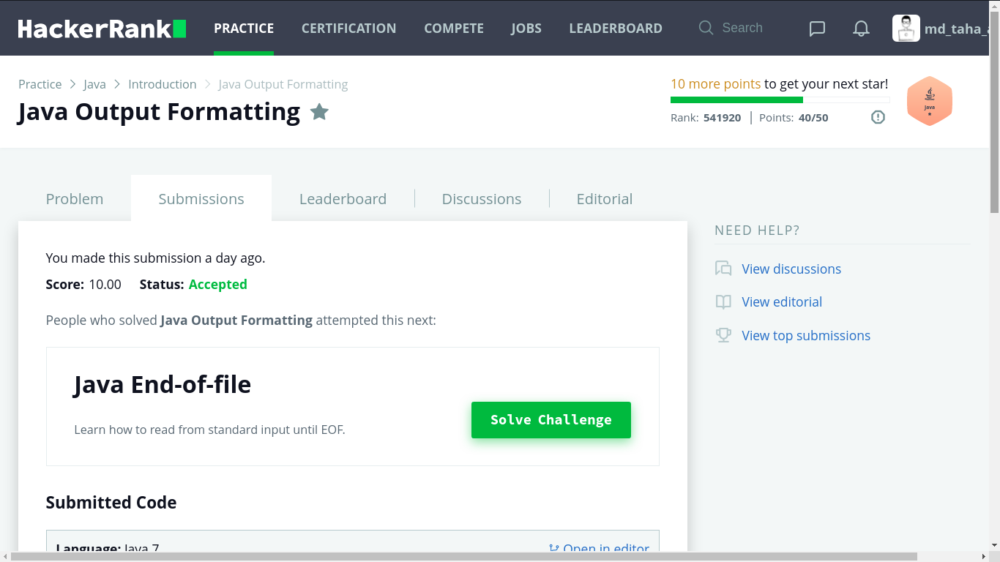

# Output formatting

 This program is use to print 3 Strings with integer , which the string should has exactly 15 characters places and the integer should has only 3 places.
 #### note: if the given string has less than 15 characters then it'll print spaces, and for the integer it'll print zeros.  

## Screenshots:

### score Screenshot

